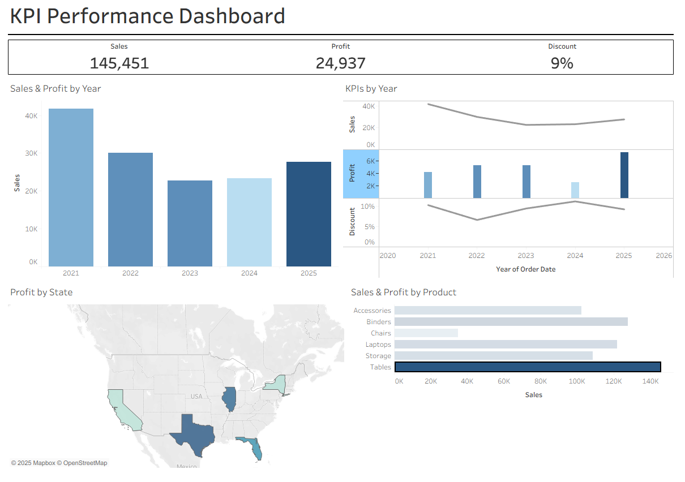

# 💼 Sales & Customer Tableau Dashboard
## 📌 Project Overview
This project showcases an interactive Tableau dashboard analyzing multi-year sales, profit, and discounts across customers, products, and regions.
## 🔎 Key Features
📈 **Sales & Profit by Year** — Use this view to quickly compare year-over-year results and identify inflection points for deeper drill-downs by segment or region.

🌍 **Profit by State** — A geographic breakdown that highlights profit hotspots and underperforming states at a glance.

📅 **Monthly KPIs** — Yearly trends tracking Sales, Profit, Discount core health metrics across the selected date range.

🪑 **Sales & Profit by Product** —  (Accessories, Binders, Chairs, Laptops, Storage, Tables) - Use it to surface high-revenue/low-margin items

## 🛠️ Tools & Techniques
- Tableau for data modeling and visualization
- CSV for initial data exploration
- GitHub for portfolio documentation and sharing

## ⚙️ Skills Demonstrated
-	Data prep in CSV (4+ years of records)
-	Data modeling & joins in Tableau
-	Trend lines, maps, KPI cards
-	Clean, pragmatic dashboard design

## 🎯 Purpose
This dashboard provides a single, interactive view of multi-year sales performance to help leaders quickly identify growth drivers and margin leakage across time, geography, and product lines. It enables data-driven decisions on pricing/discounts, product mix, and regional focus.

## 🔗 Files Included
- `KPI Performance Dashboard.twb` — Tableau workbook file  
- `customers.csv` — Sample dataset  
- `products.csv` — Sample dataset
- `invoices.csv` — Sample dataset
- `KPI_Dashboard.mp4` — Dashboard Video
- `KPIDashboard.png` — Dashboard Image
- `README.md` — Project documentation (this file)

## 🧪 Why This Matters
A compact, real-world scenario showing how data modeling + visualization answer:
- Which products drive the highest profit?
- Which regions underperform and need attention?

## 📊 Sample Visuals

## 📊 Sample Video Demonstration
▶️ [Watch on YouTube]( https://youtu.be/tYaK201HgPI)

## 🗂️ Project Status

✅ Complete – Ready for demonstration and portfolio inclusion  

## 📫 Contact
Catherine McKillips

[LinkedIn](https://www.linkedin.com/in/catherine-mckillips-data-analytics)  

## 📧 Email
cathymckillips@gmail.com
